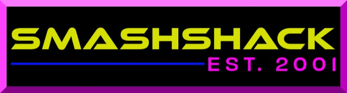

# 🏚️ Welcome to the SMASHSHACK 🏚️

> *"Hello websurfer. You have stumbled across my page."*



This is a preserved, retro-style personal website built with authentic old-school HTML, CSS, and Javascript. It captures the essence of the early 2000s web culture, complete with GIFs, a jukebox, and even an interdimensional cable TV player.

## 🌟 Features

- **📻 Jukebox:** A fully functional retro music player with track visualization.
- **📺 SmashTV:** An interdimensional cable experience (found in `/tv.lilsmash.com`).
- **🕹️ Retro Aesthetics:** Hand-picked GIFs, blink tags (spiritually), and classic button rows.
- **🎞️ Movie Scroller:** A cinematic marquee of cult classics.
- **💬 Chatbox:** Integration for real-time surfer interaction.

## 🚀 Deployment (Docker & Coolify)

This repository is container-ready and optimized for deployment on **Coolify** or any Docker-compatible hosting environment.

### Quick Start with Docker

1. **Clone the repository:**
   ```bash
   git clone https://github.com/yourusername/lilsmash-retro-site.git
   cd lilsmash-retro-site
   ```

2. **Build and Run:**
   ```bash
   docker-build -t smashshack .
   docker-run -p 8080:80 smashshack
   ```
   *Access the site at `http://localhost:8080`*

### Deploying on Coolify

1. Create a **New Resource** in Coolify.
2. Select **Public Repository**.
3. Point it to your GitHub URL.
4. Coolify will automatically detect the `docker-compose.yml` and deploy the Nginx container.

## 📂 Project Structure

- `public_html/`: The heart of the retroness.
  - `index.html`: The main portal.
  - `tv.lilsmash.com/`: Interdimensional TV application.
  - `music/`: The jukebox playlist.
  - `img/` & `buttons/`: Authentic visual assets.
- `Dockerfile`: Nginx-based container configuration.
- `docker-compose.yml`: Orchestration for easy deployment.

## 📜 Preservation Note

The files in `public_html` are intended to remain **as-is** to maintain the "retroness" of the design. Modifications to the core HTML/CSS are discouraged unless you're adding more 2004-era magic!

---
*Created by [Smash](https://lilsmash.com) | Preserved for the modern web.*
